2D Airfoil Grid Results Summary
===============================

Grid #1: Algebraic grid with non-clustered points in y
------------------------------------------------------

The figure below shows the grid points alignments made by the GridGen code with algebraic grid and uniform grid spacing assumptions at every boundary edges. The interior points were generated by applying linear interpolation based on two opposed pre-specified grid points. Thus the current grid has almost straight lines but with normally inclined angles, which makes a little skewed cells in the leading edge of the air foil. Also we can find a sudden change in cell volume across two grid lines in leading and trailing edges of the airfoil.

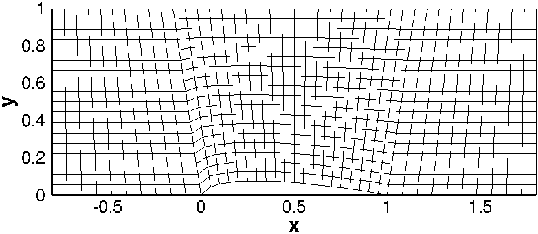
    
    :Grid points alignment of Grid #1

The more quantitative analysis is available with grid Jacobian contour on the current mesh. The 'Jacobian' here is inherently defined as determinant of inverse grid Jacobian matrix at every single grid point. Thus, it indicates a grid cell volume in 3D and cell area in 2D.

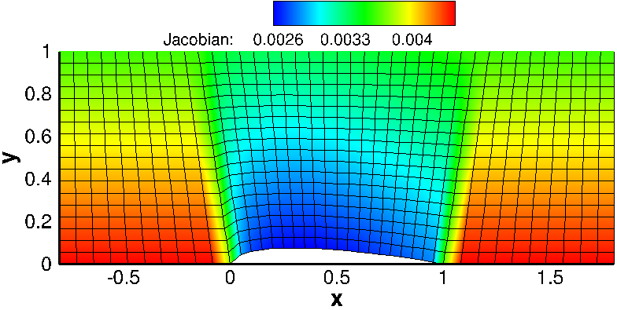
    
    :Inverse Grid Jacobian distribution of Grid #1

Grid #2: Algebraic grid with clustered points in y
--------------------------------------------------

This grid is based on the same approach for Grid #1. The only change in this grid was to apply gradually clustered grid points downward at left and right boundaries. Note that the linear interpolation of :math:`x`-coordinates along the each vertical line is made only on the basis of j-index as formulated earlier. The effect of this is to make x coordinate shifting along the vertical line is identical for every point. Thus it leads to the somewhat much shifting for concentrated grid points in :math:`y`-direction. Now we can observe non-linear grid lines in j-direction. This makes grid less skewer in the leading edge of the airfoil.

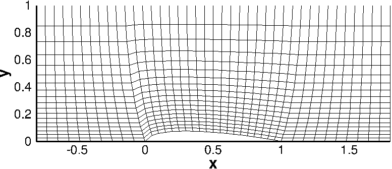

    :Grid points alignment of Grid #2

The grid Jacobian contour is shown below. Applying grid stretching along the :math:`y` direction gives big cell volume distribution. Change in volume along the bottom edge looks less significant even in the leading edge. Since, however, the grid spacing is not changed in :math:`x` direction from Grid #1 alignment, we could expect some error in flux throught the cell face at leading edge. The same situation happens at the trailing point of the airfoil. In some points, this grid alignment is more reliable for this geometry because the significantly high gradient of flow velocity will only take place in the leading edge and therfeore we need more dense grid points in this region.

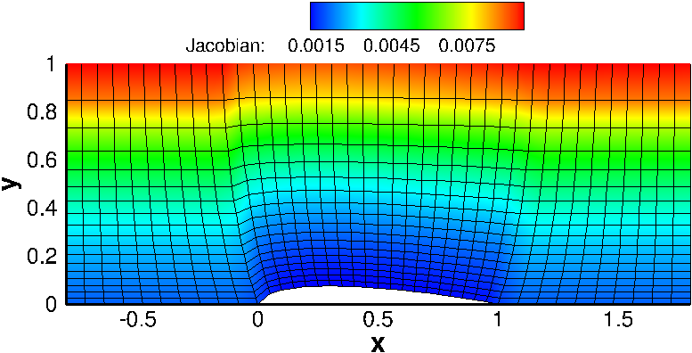
    
    :Inverse Grid Jacobian distribution of Grid #2

Grid #3: Elliptic grid with clustered points in y & no control terms
--------------------------------------------------------------------

The grid shown below is made by the elliptic Poisson equations with clustered grid points in vertical direction. As expected, the Poisson equation with no control terms draws grid alignments that resemble iso-stream lines and iso-potential lines around the airfoil body. This is because the set of Poisson equation is exactly the same as a set of stream function and potention function when the control terms are ignored.

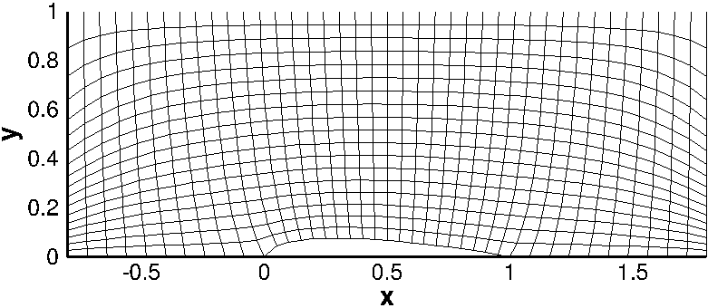
    
    :Grid points alignment of Grid #3

However, it is expected that curved lines right at the inlet edge and outlet edge are not aligned with the inlet flow. This misaligment could cause issues in the flux evaluation of flow properties across the j-constant lines and thus it would make numerical errors. From the grid Jacobian contour result, sudden change in cell volume along the flow direction can be found. Maximum and minimum cell volume are found at left and right top edge and bottom edge, respectively.

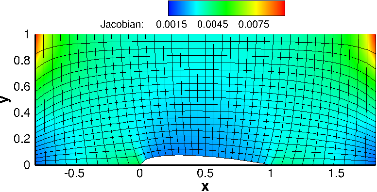
    
    :Inverse Grid Jacobian distribution of Grid #3

Grid #4: Elliptic grid with clustered points in y & control terms
-----------------------------------------------------------------

The problem that arise in Grid #3 case was able to be resolved by adding control terms in the Poisson equation. From the mesh shape of Grid #4 shown below, it can be found that adding control terms plays an important role in improving grid orthogonality. Thus now we have better grid aligment especially along the flow stream lines that can be expected intuitively. Even though there is a significant change in grid size along the vertical line, it may not act as a critical issue for numerical accuracy because the flux in vertical direction will not be critical.

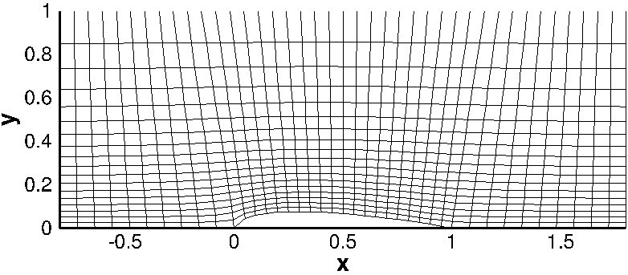
    
    :Grid points alignment of Grid #4

In this grid, we can find a severely skewed cell in the leading edge of airfoil. This is more severe than Grid #3. Making orthogonality for the vertical lines cause more vertically stand i-constant lines, hence it leads to the sharp angle between airfoil arc and i-constant line anchored at the leading edge.

    
    : Inverse Grid Jacobian distribution of Grid #4

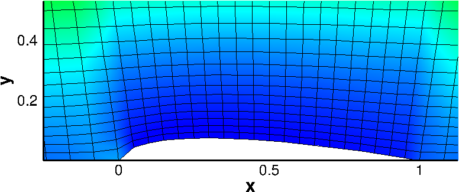
    
    : Zoomed Inverse Grid Jacobian distribution of Grid #4 over airfoil surface

Grid #5: Improved elliptic grid
-------------------------------

Based on the above grid results we can conclude that the best grid quality is Grid#4. Although Grid#4 shows promixing results, the following issues are still to be resolved:

#. At both the leading edge and trailing edge of the airfoil there is still some sudden variation in the cell size.
#. Large variation in skeweness of the grid is observed when control terms are applied.

To handle the above problems the following approach is implemented:

#. Maintain the grid stretched along the y direction with the same Cy.
#. Provide smooth cell size transition along the segments FE,ED, and DC by employing testing varying values of Cy.
#. Provide new Cy parameters for stretching in Psi and Phi

The following values of Cy were chosen for the best grid quality:

+----------------------+----------+
| Method               | Cy       |
|                      |          |          
+======================+==========+
| Stretching along y   | 2.0      |
+----------------------+----------+
| Stretching along FE  | -1.0     |
+----------------------+----------+
| Stretching along ED  |  1.0     |
+----------------------+----------+
| Stretching along DC  | 0.001    |
+----------------------+----------+
| Stretching in Phi    | -11.0    |
+----------------------+----------+
| Stretching in Psi    | 0.001    |
+----------------------+----------+

According to the above table a stretching method was applied to the bottom segment of the grid in order to improve the smoothness of the cell variation in area. This adjustment in the values of Cy allowed to increase the number of grid points near the leading edge and trailing edge of the airfoilf as we expect to obtain greater variation in flow properties along this section of the flow field.
A note must be made regarding the segment AB. This portion of the grid was left uniform as we do not expect to have large variation in flow properties in such region of the grid.

Furthermore, stretching for :math:`\phi` and :math:`\psi` was applied in order to improve the grid alingment along the surface of the airfoil. A negative value for :math:`\psi`  reduces the skewness of nearby cells at the leading and trailing edge. Below the :math:`\psi`  field is compared between the original grid with constant Cy and the new improved grid.

.. table::
   :class: borderless
 
   +----------------------------------------+-----------------------------------------+
   | - Initial Grid 'cy = 0.001'            | - Grid 5 Psi Field                      |
   +----------------------------------------+-----------------------------------------+
   | .. image:: ./images_af/psi1.png        | .. image:: ./images_af/psi5.png         |
   |    :width: 90%                         |    :width: 90%                          |
   |                                        |                                         |
   +----------------------------------------+-----------------------------------------+

After completion, the overall improved grid and inverse Jacobian are presented below:

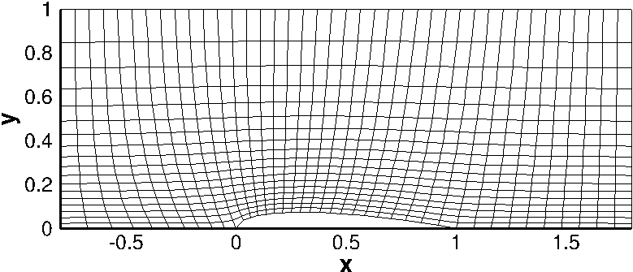
    
    :Grid #5

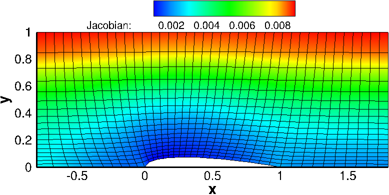
    
    :Inverse Grid Jacobian distribution of Grid #5

As shown from the inverse of the Jacobian, most of the smalle area cells are located along the surface of the airfoil where the flow prperties significantly change.

Residual Convergence
--------------------

The residual is one of the most fundamental measures of an iterative solution's converence, as it directly quantifies the error in the solution. The image below show the RMS residual for the last three grids generated through this code.

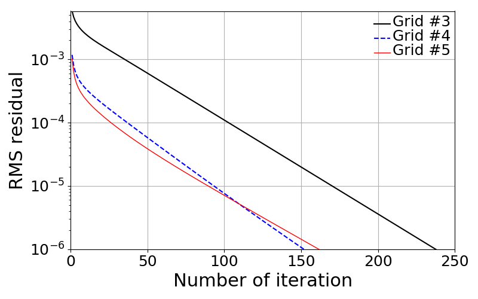

    :RMS Residual

It can be noted that as we apply the control terms for the elliptical grid generation, the number of iterations required for the RMS residual to approach the desired limit is reduced.

